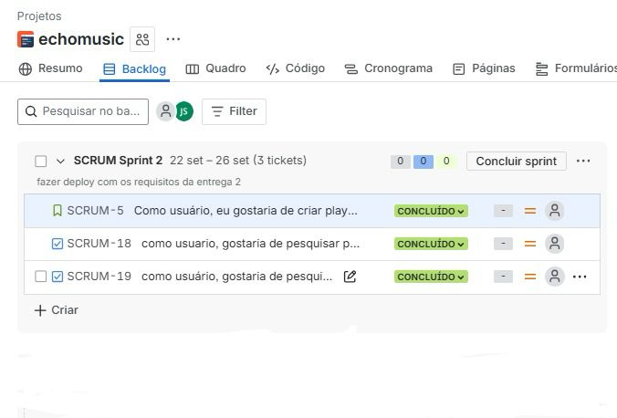
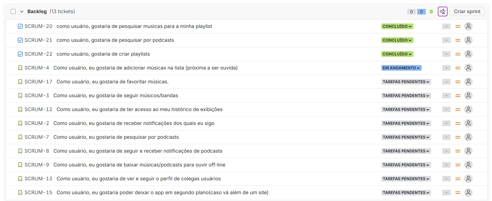
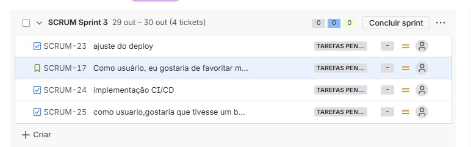
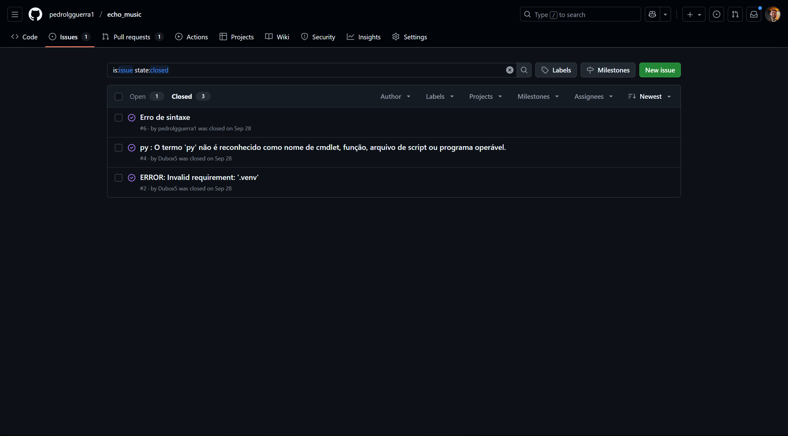

# 🎶 Echo - Seu Universo Musical

O **Echo** é um site de músicas criado para proporcionar uma experiência simples, moderna e envolvente para os amantes da música.  
Com ele, você pode explorar playlists, descobrir novos artistas e curtir suas faixas favoritas em um só lugar.  

---

## 🚀 Funcionalidades

- 🎧 **Player online** com controle de reprodução.  
- 🔎 **Busca de músicas e artistas** de forma rápida e intuitiva.  
- 🎶 **Playlists personalizadas** para diferentes estilos e moods.  
- 📱 **Design responsivo**, adaptado para desktop, tablet e celular.  
- 🌙 **Tema claro e escuro** para se ajustar ao seu gosto.  

---

## 🛠️ Tecnologias Utilizadas

- **Frontend:** HTML5, CSS3, JavaScript (React ou Vanilla JS)  
- **Backend:** Python, Django  
- **Banco de Dados:** MongoDB ou MySQL  
- **Autenticação:** JWT ou OAuth 2.0 . 
- **Hospedagem:** Vercel / Netlify (frontend) e Heroku (backend)  

## Entregas

✅Entrega - 01

 **Quadro Jira**

[📄 **Documentação no Google Docs**](https://docs.google.com/document/d/1iIE2TN-brDPJG4-VLgA5vC3a-OJslN4rudeJ6qXee54/edit?tab=t.0#heading=h.ydhtqjk9ltrr)

[▶️ **Screencast Figma**](https://youtu.be/5f4h1V8EvZw?si=Puvt2TmS40G6oNOg)

✅Entrega - 02

[▶️ **Screencast Deploy**](https://www.youtube.com/watch?v=XL0pxdvjNLw)

***Programação em par***  
Sessão do Dia 29/09/2025 - Desenvolvimento da Página Home  
Foco: Estrutura e componentes principais da página Home.

Piloto (Driver): Pedro Guerra  
Navegador (Navigator): Ramses

**Atividades Realizadas:**
- Criação da estrutura semântica do HTML da página Home (header, banner, serviços, footer).
- Estilização do layout principal com CSS.
- Implementação do menu de navegação.
- Ajustes de design para garantir a consistência visual em diferentes tamanhos de tela.

✅Entrega - 03

[▶️ **Screencast Testes**](https://youtu.be/yEldrKc7uEs?si=b0utGYSF11F_M0df)

***Programação em par***
sessão do Dia 20/10/2025 - Desenvolvimento das historias e preparação da implementação junto com o deploy
foco: estrutura das novas funcionalidades
Piloto (Driver): Pedro Guerra
Navegador (Navigator): Lucas Samuel

**Atividades Realizadas (Implementação das Histórias):**
- Integração do player com backend para reprodução de músicas.
- Testes unitários iniciais para funcionalidades críticas do player.

**Ajustes no Deploy:**
- Configuração de variáveis de ambiente no backend e frontend.
- Ajustes no build para compatibilidade com Vercel.

**Implementação CI/CD:**
- Configuração de pipeline no GitHub Actions:
  - Build automático do frontend e backend.

✅Entrega - 04

[▶️ **Screencast Testes**](https://youtu.be/382rkh2EzDI?si=NpW2iU0uDMhbUsmk)

[▶️ **Screencast Deploy**](https://youtu.be/bjmRcy088BA?si=JOn8UDJXUZpSIW5m)

***Relato de Programação em Par*** – 02/11/2025

Durante a sessão de programação em par realizada em 20/10/2025, com Pedro Guerra como Piloto (Driver) e Lucas Samuel como Navegador (Navigator), finalizamos as últimas histórias planejadas para o ciclo atual. As atividades concluídas envolveram o desenvolvimento e integração das funcionalidades pendentes, garantindo que todas estivessem prontas para a fase de implementação completa e para o processo de deploy.

As histórias foram revisadas, ajustadas e concluídas conforme os critérios de aceitação, assegurando alinhamento técnico e funcional com os objetivos do projeto.

Se quiser, posso gerar uma versão mais formal, mais detalhada ou mais curta.

