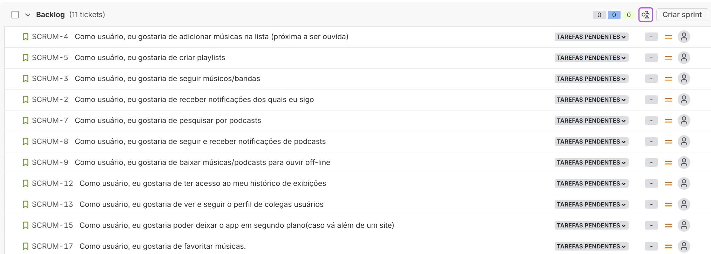

# 🎶 Echo - Seu Universo Musical

O **Echo** é um site de músicas criado para proporcionar uma experiência simples, moderna e envolvente para os amantes da música.  
Com ele, você pode explorar playlists, descobrir novos artistas e curtir suas faixas favoritas em um só lugar.  

---

## 🚀 Funcionalidades

- 🎧 **Player online** com controle de reprodução.  
- 🔎 **Busca de músicas e artistas** de forma rápida e intuitiva.  
- 🎶 **Playlists personalizadas** para diferentes estilos e moods.  
- 📱 **Design responsivo**, adaptado para desktop, tablet e celular.  
- 🌙 **Tema claro e escuro** para se ajustar ao seu gosto.  

---

## 🛠️ Tecnologias Utilizadas

- **Frontend:** HTML5, CSS3, JavaScript (React ou Vanilla JS)  
- **Backend:** Python, Django  
- **Banco de Dados:** MongoDB ou MySQL  
- **Autenticação:** JWT ou OAuth 2.0  
- **Hospedagem:** Vercel / Netlify (frontend) e Render / Heroku (backend)  

## Entregas

✅Entrega - 01

 **Quadro Jira**

[📄 **Documentação no Google Docs**](https://docs.google.com/document/d/1iIE2TN-brDPJG4-VLgA5vC3a-OJslN4rudeJ6qXee54/edit?tab=t.0#heading=h.ydhtqjk9ltrr)

[▶️ **Screencast Figma**](https://youtu.be/5f4h1V8EvZw?si=Puvt2TmS40G6oNOg)

Entrega 02

Entrega 03

Entrega 04

